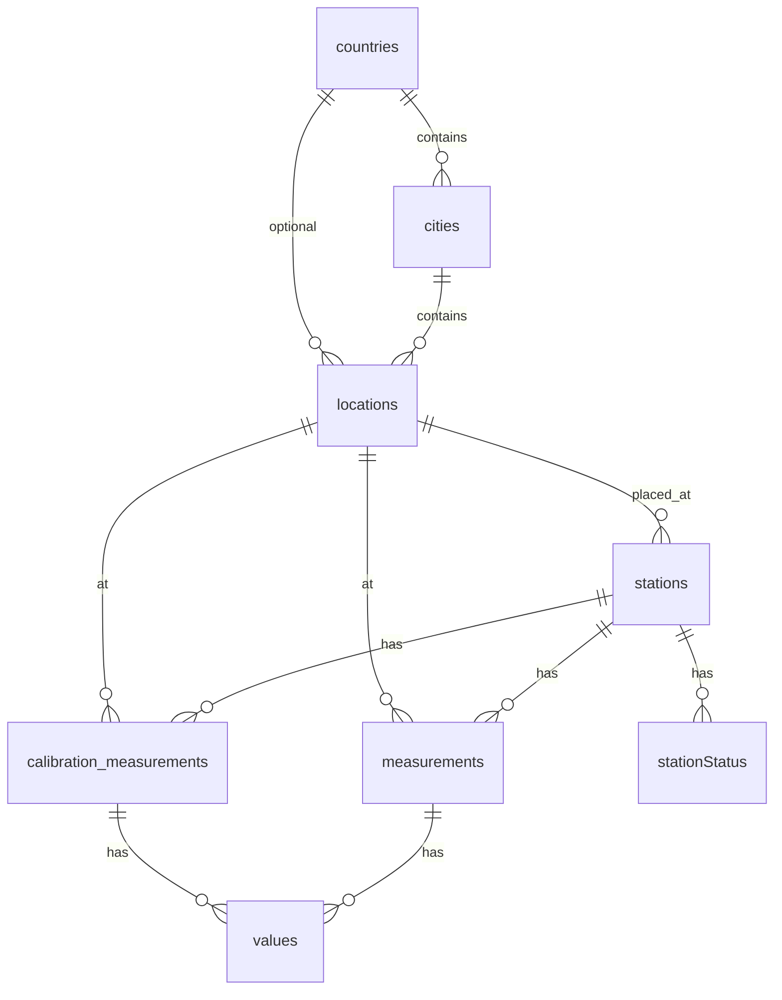

# Database structure

PostgreSQL schema used by **luftdaten-api**. The SQLAlchemy models live in [`code/models.py`](../../code/models.py); migrations are under [`code/alembic/versions/`](../../code/alembic/versions/).

| Document | Contents |
|----------|-----------|
| [tables.md](tables.md) | Base tables, columns, keys, relationships |
| [views-indexes-extensions.md](views-indexes-extensions.md) | Materialized views, SQL view, refresh functions, indexes, extensions |

Source of truth for column Python types: [`code/models.py`](../../code/models.py).

## Conventions

- **Timestamps:** ORM columns use `DateTime` without timezone → PostgreSQL **`timestamp without time zone`**. Application code treats stored instants as **UTC wall clock** for ingest and comparisons; API responses may format them in **Europe/Vienna** (see [Dates and timezones](../endpoints.md#dates-and-timezones) in the HTTP reference).
- **Integer enums:** `source`, `sensor_model`, and `dimension` on measurements / values map to labels in [`code/enums.py`](../../code/enums.py) (`Source`, `SensorModel`, `Dimension`).
- **`values` rows:** Either `measurement_id` **or** `calibration_measurement_id` is set (normal vs calibration path), not both.

## Entity overview



Scheduled jobs refresh **materialized views** for `/statistics` and `/station/all` (see [views-indexes-extensions.md](views-indexes-extensions.md)).

## Applying schema changes

Use Alembic from the app container (see root `README.md`):

```bash
docker compose exec app alembic upgrade head
```
