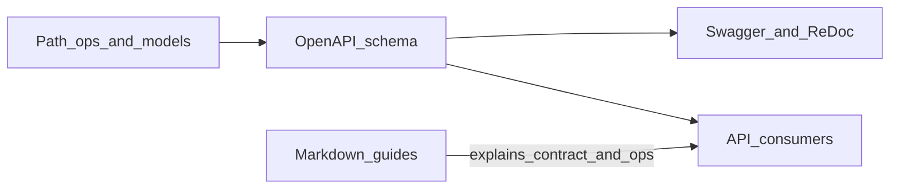

# FastAPI documentation (OpenAPI) — guide

This section explains how to document a **FastAPI** application so the generated **OpenAPI** schema, **Swagger UI** (`/docs`), and **ReDoc** (`/redoc`) stay accurate and useful. It is written for maintainers of **luftdaten-api**; for the live HTTP contract as prose, see the links below.

## Documentation in this repo

| What | Where |
|------|--------|
| API index (interactive doc URLs, `/v1` note) | [../README.md](../README.md) |
| Full endpoint reference (parameters, status codes, behavior) | [../endpoints.md](../endpoints.md) |
| Database | [../database/README.md](../database/README.md) |

## Official FastAPI references

- [Metadata and Docs URLs](https://fastapi.tiangolo.com/tutorial/metadata/) — `FastAPI()` metadata, `openapi_tags`, `openapi_url`, `docs_url`, `redoc_url`
- [Path Operation Configuration](https://fastapi.tiangolo.com/tutorial/path-operation-configuration/) — `summary`, `description`, docstrings, `status_code`, `deprecated`, `tags`
- [Path Operation Advanced Configuration](https://fastapi.tiangolo.com/advanced/path-operation-advanced-configuration/) — OpenAPI extensions, `responses` customization
- [Additional Responses](https://fastapi.tiangolo.com/advanced/additional-responses/) — extra status codes, examples
- [Security](https://fastapi.tiangolo.com/tutorial/security/) — dependency-based auth; combine with `openapi_components` / `Security` where you need the schema to advertise schemes

## How it fits together

FastAPI builds an **OpenAPI** document from your routes, parameters, and Pydantic models. That document drives interactive UIs and client tooling. Long-form operational details (blacklists, CORS, time zones) may still live in [../endpoints.md](../endpoints.md) even when the schema documents the request/response shapes.

## Chapters

1. [OpenAPI and FastAPI](01-openapi-and-fastapi.md)
2. [App metadata and servers](02-app-metadata-and-servers.md)
3. [Tags and routers](03-tags-and-routers.md)
4. [Path operations](04-path-operations.md)
5. [Models, parameters, and responses](05-models-parameters-responses.md)
6. [Security and versioning](06-security-and-versioning.md)
7. [Checklist: luftdaten-api](07-checklist-luftdaten-api.md)
